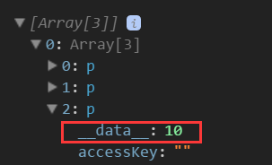
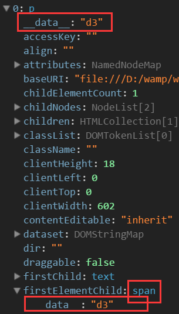

# 选择符

> 获取元素

和DOM3 querySelector/querySelectorAll差不多拥有

- select() 匹配选择器的第一个元素

- selectAll() 匹配选择器的所有元素

同时也可以用DOM

    var oDiv = document.getElementById("div1");
    d3.select(oDiv);

| one              | more                   |
|:----------------:|:----------------------:|
| getElementById() | getElementsByTagName() |
| select           | selectAll              |

> 看状态

- empty()返回一个布尔值是不是空，是空则返回true
- node()返回第一非空的元素，如果是空返回null
- size()所选元素的个数

# 数据绑定
> datum()

**datum将绑定相同的数据**
**datum(value) value可以是number/string/boolean/object**

- **定义一个无名函数function(d,i),在函数体中使用d和i**

<pre>
    p.datum('d3').text(function(d,i){
            //d表示datum,i表示index索引
            return d + ' ' + i;
        })
</pre>

- **能使绑定的数据传递给子元素**
    - **在被绑定数据的选择集中添加元素，新元素会继承该数据**

<pre>
    p.datum('d3')
        .append('span')
        .text(function(d,i){
            return ' '+ d;
        })
    console.log(p)
</pre>

>data()

**data**